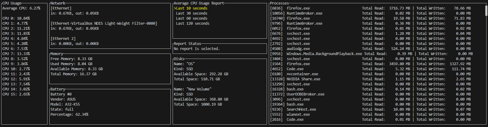

# System Analyzer
by 66011231 Sorasich Lertwerasirikul
King Mongkut's Institute of Technology Ladkrabang

# Description
System Analyzer is a TUI which displays various information(e.g. CPU usage, memory, battery, etc.) of your machine. All information is shown on a single dashboard with an option
to generate a HTML report of the average CPU usage over a selected time period.

# Features

This is what the program looks like.
___

### CPU Usage

This block displays your CPU usage on each thread and an average of all threads.
___

### Network

This block displays your transmitted and received data in kilobytes for each network.
___

### Memory

This block displays your free, used, available and total memory.
___

### Battery

This block displays your battery information:
  *
### Average CPU Usage Report
### Report Status
### Disks
### Processes
