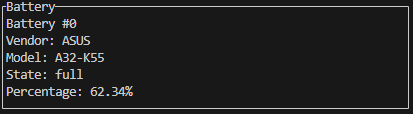

# System Analyzer
by 66011231 Sorasich Lertwerasirikul  
King Mongkut's Institute of Technology Ladkrabang

## Description
System Analyzer is a TUI which displays various information(e.g. CPU usage, memory, battery, etc.) of your machine. All information is shown on a single dashboard with an option
to generate a HTML report of the average CPU usage over a selected time period.

## Features
This is what the program looks like.

___

#### 1. CPU Usage

This block displays the following in percentage:
 * Each CPU thread
 * The average of all threads
___

#### 2. Network

This block displays the following in kilobytes for each network:
 * Transmitted data
 * Received data
___

#### 3. Memory

This block displays the following in gigabytes:
 * Free memory
 * Used memory
 * Available memory
 * Total memory
___

#### 4. Battery

This block displays the following:
  * Vendor name
  * Model name
  * Battery state(e.g. discharging)
  * Charge percentage
___

#### 5. Average CPU Usage Report
    

This block displays the different durations of the average cpu usage report in which the user can select. 
Use the left or right arrow key to naivate(or use A or D), and enter to get the report.  
**Note: The report shows numbers from the past X seconds.**   
#### Examples
|  |  |  | 
| -------- | -------- | -------- |
| Last 10 seconds report | Last 30 seconds report | Last 60 seconds report | 

|  |
| --- |
| Last 120 seconds report |

___

#### 6. Report Status
|  |  |  |
| -------- | -------- | -------- |
| No report generated message | Report generated message | Report duration longer than program runtime message |

This block displays the current status of the report generation.
___

#### 7. Disks

This block displays the following for each disk:
 * Name
 * Type
 * Available space
 * Total space
___

#### 8. Processes
  

This block displays the following in megabytes for each program:
 * Total read data
 * Total written data

Use the up or down arrow key to naivate(or use W or A).
___
